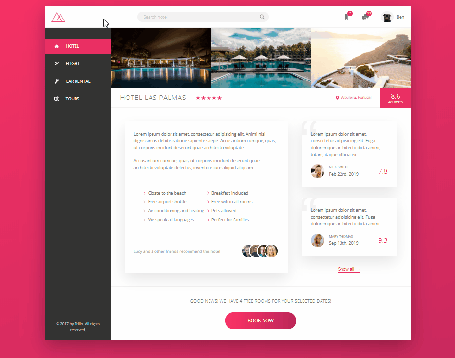
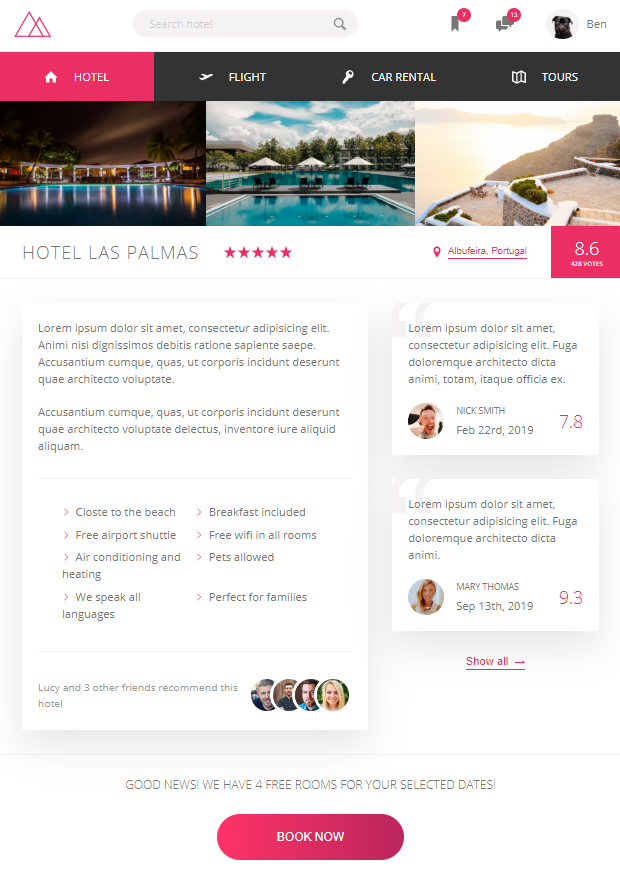

# Trillo
Trilo front-end project

## Table of contents
* [General info](#general-info)
* [Technologies](#technologies)
* [Try out](#try-out)
* [Sources](#sources)

## General info

The application

## Technologies
* JavaScript 2015+
* Webpack

## Try out
https://mkarasinski.github.io/Trillo/

## Demo

  

  

  

  

## Sources
This app is based on Advanced CSS and SASS Tutorial by Jonas Schmedtmann on Udemy.  
https://www.udemy.com/course/advanced-css-and-sass/
